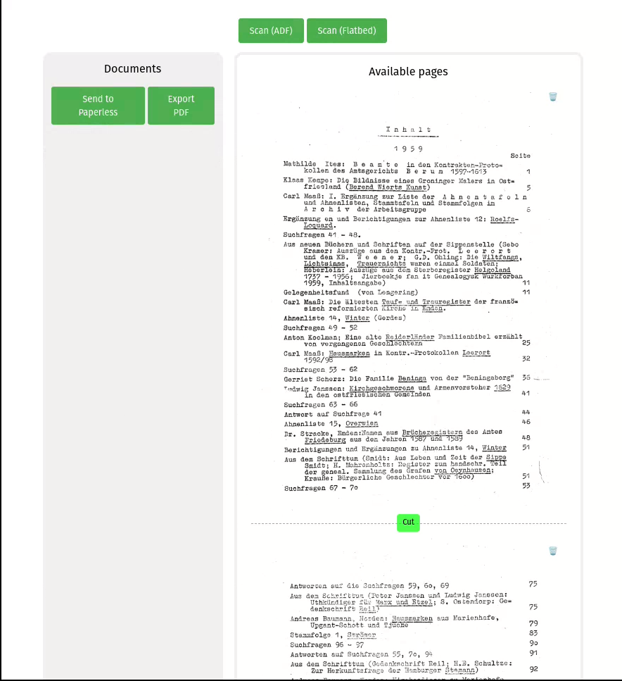
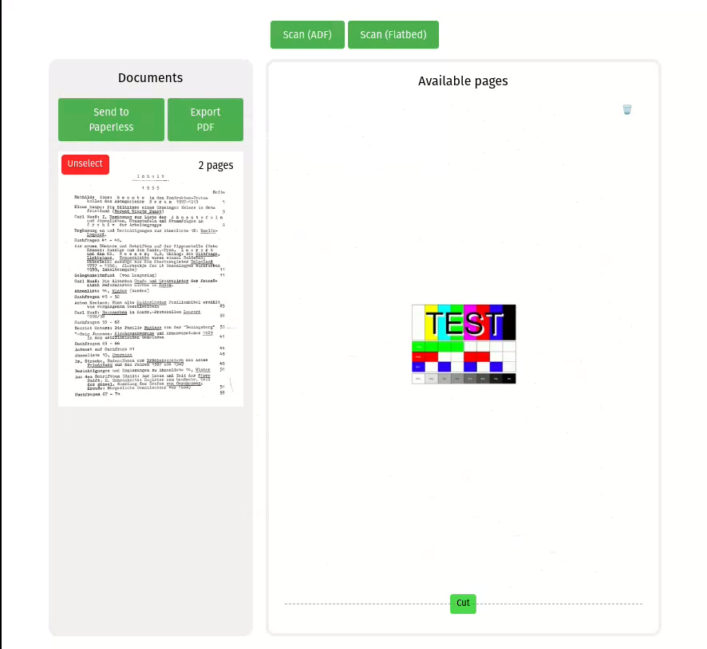

# Scanner Pipeline

Customizable document scanning app. Can be used to scan individual or many pages,
split then into documents and export (for example as PDF). I use it to feed a stack of papers to my
scanner and send documents to Paperless.

Will work with any scanner that has some sort of Linux support, though you may need to make your own
Dockerfile and scanning script. Example included for Canon Pixma MX925 (my scanner) for dual sided
ADF scanning and flatbed scanning.

Fully customizable processing pipeline for scanned documents, and exporting (via bash scripts). Can convert,
straighten, rename, cleanup the image or anything you need. Again, you just need
to tinker with your own scripts if the included ones don't work for
you. I use Imagemagick in my processing.




## How to use

### Prepare
To try locally (without using scanner), *first copy some images of scanned pages* (images, not pdfs) to
`docker-compose-example/sample/input`. These are loaded into the app when you press "Scan" to
simulate scanning.

After that you can run in development mode (with elixir) or with docker.

### Locally in development mode
PDFs, processed scans and thumbnails endup in `dev_output` directory.

#### Setup
Install elixir and nodejs, also preferrably imagemagick to run the pipelines.

Install dependencies:
```sh
mix deps.get
```

#### Start
```sh
mix phx.server
```
Go to http://localhost:4000/

### Locally with docker
`SECRET_KEY_BASE` environment variable required. It is a random string.
Make sure you have that defined in `.env` file or in `docker-compose.yml`.

#### Sample pipelines
Docker-compose file:
`docker-compose-examples/pixma-mx925/docker-compose.yml`.
Start with:
```sh
docker compose up --build
```


#### Canon Pixma MX925
Docker-compose file:
`docker-compose-examples/pixma-mx925/docker-compose.yml`.
Either start the project in place or copy docker-compose.yml and
subdirectories to another directory.

If you copy the docker-compose file to another directory, fix
context path of app-base to point to the project root. Copy example pipeline scripts and update path references.

Fill in your PRINTER_IP in the docker-compose file.

`SECRET_KEY_BASE` environment variable is required. It is a random string.
Make sure you have that defined in `.env` file or in `docker-compose.yml`.

In the directory of your docker-compose.yml file:
```sh
docker compose up --build
```


### Creating your own processing scripts

#### Image processing pipelines
Look into `docker-compose-example/pixma-mx925` for examples.

`config.yaml` defines what pipelines are used for scanning and exporting.
There can be multiple, each one will be its own button in the UI.

Processing pipelines are under `pipelines/` and the scripts inside are executed
in alphabetical order. The output of the last script is used as the input for
the next.
`thumbnail` is a special one used for generating the preview image in the UI.
Others, like `scan_adf` or `pdf` are the ones used for scanning and exporting
as defined in `config.yaml`.

A good starting point to create your own script is
`docker-compose-example/pipeline-template.sh`. For a simple task (one command)
you only need to write it in `PROCESS_COMMAND` variable in the beginning.

All scripts get exactly one argument, which is the input *directory* or *file*.
If the argument is a directory, the script should process everything
inside that directory.

Script is always executed where the output should end up (can be
a temp directory or the final output directory). *This means if the
script does nothing, the files will be discarded*. So bare minimum
if you want to keep a file unchanged, you need to copy the file
to current dir in the script. That way it is passed to the next
script in the pipeline.

#### Export pipelines
Export pipelines work in the same way, but they only take a directory as argument.
The directory will contain the selected pages to export.
Example pipeline will create a PDF, and it will end up in `output/pdf`
(subdir can be different, named after your export pipeline) directory.

If you need to send the PDF for example to Paperless, make another script
which copies to paperless consume directory, or uses scp, or
whatever you need to do. Another option is to have the `output/pdf`
volume shared with paperless, if you are running it on the same host.
